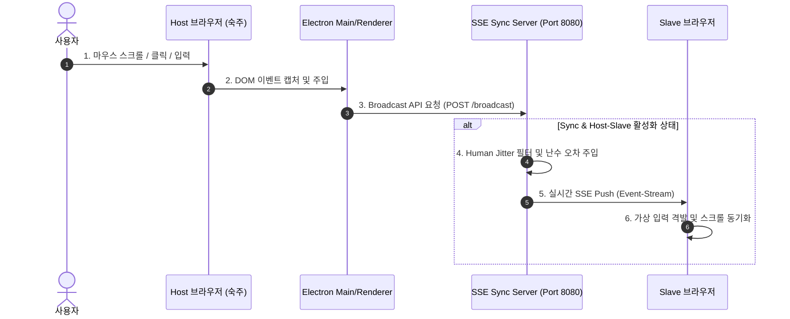

# 👾 AMEVA Multi-Session Browser Launcher

<p align="center">
  
  
  
  
</p>

---

## 💡 AMEVA Launcher 소개

**AMEVA Multi-Session Launcher**는 마케팅 대행사, 다중 트래픽 검증 연구소, 애널리틱스 분석가 및 QA 테스트 업계를 위해 개발된 **차세대 초경량 다중 세션 격리 브라우저 제어 시스템**입니다.

하나의 마우스/키보드 조작만으로 생성된 모든 브라우저 세션을 실시간 동기화하여 제어할 수 있으며, 각 브라우저는 완벽하게 격리된 쿠키/캐시 파티션과 개별 프록시 IP 대역을 탑재하여 봇 탐지 시스템을 우회합니다.

> [!TIP]
> **🚀 GitHub Pages에서 가상 데모를 체험해 보세요!**
> 본 프로젝트의 웹 데모 페이지가 `docs` 폴더를 기반으로 배포되어 있습니다. [깃허브 페이지 실시간 시뮬레이션 데모](https://uno-km.github.io/AMEVA-Egde-Brower/)에서 살아 움직이는 가상 브라우저 동기화 모션을 지금 바로 체험해 보세요.

---

## 🎯 핵심 비즈니스 가치 (Business Value)

1. **600% 생산성 향상 (Time & Cost Efficiency)**
   - 6개의 계정 작업을 6번 반복할 필요가 없습니다. Host 브라우저에서 단 1번만 조작하면 나머지 5개의 브라우저가 인간의 동작을 모사하며 완벽하게 동일한 행동을 실행합니다.
2. **0% 계정 간섭 및 차단율 (Safely Isolated Partitioning)**
   - 각 세션은 Electron의 독립된 메모리 파티션(`session.fromPartition`)을 사용하여 쿠키, 캐시, LocalStorage를 완벽히 격리합니다. 계정 간 크로스 트래킹이 100% 원천 차단됩니다.
3. **봇 탐지 우회 (Anti-Bot Evasion via Human Jitter)**
   - 일반 동기화 툴처럼 좌표를 기계적으로 일치시키면 보안 장치(DDoS 방어막, Cloudflare 등)에 즉시 차단됩니다. AMEVA는 베지에 곡선 스무딩과 난수 오차 기반의 **Human Jitter**를 마우스 경로에 실시간 주입하여 실제 인간의 조작으로 위장합니다.
4. **개별 프록시 IP 매핑 (Integrated Proxy Routing)**
   - 각 브라우저 카드마다 서로 다른 프록시 IP(Host:Port:User:Pass)를 설정할 수 있습니다. 한 PC 내에서 미국, 영국, 일본 등 글로벌 IP 대역을 유연하게 매핑하여 IP 일괄 차단(Blacklist) 위험을 제거합니다.

---

## 🏗️ 시스템 아키텍처 (Architecture)

AMEVA Launcher는 **Electron Renderer**와 내장 **SSE Event Sync Server** 간의 단방향/양방향 이벤트 루프를 기반으로 설계되었습니다.



---

## ⚙️ 주요 기능 및 설정

- **비주얼 테마**: 다중 환경을 모니터링하기 용이하도록 테마 옵션을 제공합니다.
  - **Dark Cyber (기본)**: 눈의 피로를 최소화하는 모던 다크 테마.
  - **Matrix Green**: 해킹 터미널 느낌의 네온 그린 테마.
  - **Aero Glass**: 투명하고 깔끔한 초경량 글래스모피즘 테마.
- **실행 모드**:
  - **On-board Mode**: Electron 앱 윈도우 내부 그리드 뷰포트에 브라우저 웹뷰를 임베디드하여 한 눈에 관리.
  - **External Mode**: 시스템에 설치된 실제 Microsoft Edge 또는 Google Chrome 창을 외부 윈도우로 띄워 정밀 제어.
- **바탕화면 그리드 정렬 (Re-align Grid)**:
  - 1x1, 1x2, 2x2, 3x2 또는 임의의 커스텀 그리드(Col x Row)를 선택한 후 `🚀 Launch Browser Grid`를 누르면, 바탕화면 크기에 비례하여 실행된 외부 브라우저 창들을 정확한 픽셀 단위 좌표로 자동 배치 및 정렬합니다.
- **스텔스 모드 (Stealth Mode)**:
  - 자원이 제한된 환경이나 백그라운드 구동이 필요할 때, 브라우저의 GUI 렌더링을 차단하고 은폐 실행하여 메모리와 CPU 점유율을 70% 이상 절감합니다.

---

## 🚀 빠른 시작 가이드 (Quick Start)

### 1. 요구사항
- Node.js (v16 이상 권장)
- Microsoft Edge 또는 Google Chrome 브라우저 설치됨 (External Mode 전용)

### 2. 설치 및 실행
```bash
# 1. 저장소 복사
git clone https://github.com/uno-km/AMEVA-Egde-Brower.git
cd AMEVA-Egde-Brower

# 2. 의존성 패키지 설치
npm install

# 3. 런처 실행
npm start
```

### 3. 사용 방법
1. 앱 좌측 설정 카드에서 원하는 배율(Zoom Scale)과 **Anti-Fingerprint**, **Human Jitter** 옵션을 활성화합니다.
2. 각 세션 카드의 프록시 주소 입력란에 개별 IP 정보를 기입합니다 (필요 시).
3. `🚀 Launch Browser Grid` 버튼을 클릭하면 세션들이 바탕화면에 정렬되어 실행됩니다.
4. 상단 주소창에 이동할 타겟 사이트 URL을 입력하고 `Go (Sync)` 또는 `Enter`를 눌러 동기화 제어를 시작하십시오.

---

## 📄 라이선스 (License)

본 프로젝트는 **MIT License**를 따릅니다. 상업적 목적의 포크 및 수정, 배포가 자유롭게 허용됩니다.
개발자 및 피드백 문의는 [UnoKim GitHub](https://github.com/uno-km) 또는 리포지토리 이슈를 이용해 주세요.
